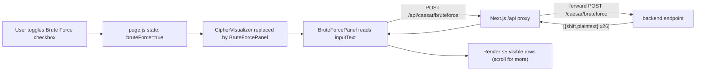
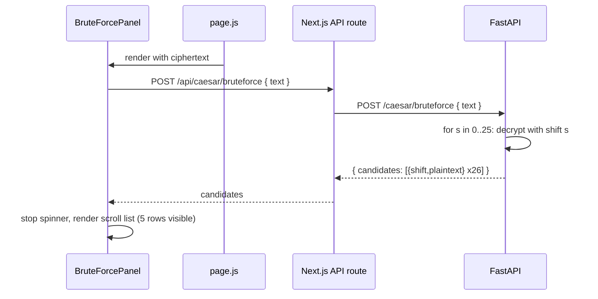

## Plan: Caesar Brute Force Panel

**TL;DR**  
Add a `POST /caesar/bruteforce` endpoint that runs all 26 Caesar shifts over a ciphertext (alphabet-only, case-preserving, non-letters untouched) and returns a JSON list of `{ shift, plaintext }`. Add a "Brute Force" checkbox next to the Caesar key in `MethodSelector`. When enabled while `method === 'caesar'` and `mode === 'decrypt'`, the existing `CipherVisualizer` is replaced by a new `BruteForcePanel` that POSTs the current ciphertext, shows a spinner during the request, then renders rows of `shift | plaintext` (plaintext clamped to one line with ellipsis) inside a scroll container capped at 5 visible rows.

---

**Steps**

1. **Backend — brute-force endpoint** (in `backend/main.py`, beside the existing `/caesar` route)
   - Add a `BruteForceResponse` Pydantic model: `{ candidates: List[Candidate] }` with each `Candidate = { shift: int, plaintext: str }`.
   - Add `POST /caesar/bruteforce` accepting `{ text: str }` (no key, no mode — only decrypt).
   - Build candidates 0..25 by reusing the same letter-only, case-preserving shift logic as `caesar_encrypt`. Each iteration shifts the ciphertext back by `s` (i.e., encrypt with `-s` modulo 26).
   - Return the full array in a single JSON response — no streaming, no pagination. Compute everything on the server then ship once.
   - **Parallel with 3.**

2. **Frontend — API helper** (extend `frontend/src/components/utils/encryptions.jsx` if it owns fetchers, otherwise add a small helper alongside the panel)
   - Add `runCaesarBruteForce(ciphertext) -> Promise<Candidate[]>` that hits `/api/caesar/bruteforce` with `POST`, JSON body, and resolves to the array (or an empty array on error).

3. **Frontend — `BruteForcePanel` component** (new file `frontend/src/components/custom/BruteForcePanel.jsx`)
   - Props: `ciphertext: string`.
   - State: `candidates`, `isLoading`, `error`.
   - On mount (and whenever `ciphertext` changes): kick off the request, set `isLoading = true`, then render one of three branches:
     - **Loading**: centered spinner with the project's existing spinner primitives + a "Brute-forcing 26 shifts…" label.
     - **Error**: small red bordered card with the message and a `Retry` button.
     - **Ready**: render a `div` with `max-h` equal to 5 row heights (`overflow-y-auto`) containing one row per candidate. Each row is a 2-column grid: `Shift {n}` on the left, the plaintext on the right. Plaintext uses `truncate` (CSS `overflow-hidden text-ellipsis whitespace-nowrap`) so anything beyond one line is cut with `…`.
   - Style with the existing token variables (`var(--panel-border)`, `var(--accent)`, `var(--text-muted)`, `var(--panel-bg)`) so it matches `CipherVisualizer`.
   - Empty-input case: show a muted "Enter ciphertext to brute-force." message instead of firing a request.

4. **Frontend — `MethodSelector` Caesar block** (in `frontend/src/components/custom/MethodSelector.jsx`)
   - In the `selected === 'caesar'` branch, alongside `<KeyInput … />`, render a small label-row containing a checkbox bound to a new `bruteForce` prop: input `<input type="checkbox">` + label `Brute Force` styled with the same `text-xs font-bold uppercase tracking-[0.18em]` pattern used by other labels.
   - Add `bruteForce` and `onBruteForceChange` props to the `MethodSelector` signature, defaulting `bruteForce` to `false`.

5. **Frontend — `page.js` wiring**
   - Add `const [bruteForce, setBruteForce] = useState(false)`; reset to `false` inside `handleMethodChange` so it doesn't leak across methods.
   - Pass `bruteForce={bruteForce}` and `onBruteForceChange={setBruteForce}` to `<MethodSelector />`.
   - In the bottom block that currently renders `CipherVisualizer`, branch on `method === 'caesar' && bruteForce && mode === 'decrypt'`:
     - True: render `<BruteForcePanel ciphertext={inputText} />`.
     - False: keep the existing `<CipherVisualizer … />`.
   - Derive `ciphertext = outputText || inputText` so even if the user didn't run the decrypt endpoint (server may be slow), the brute-force panel still has data to attack; if you prefer determinism, just pass `inputText` and let the user paste the ciphertext directly.

---

**Relevant files**
- `backend/main.py` — add Pydantic models + `POST /caesar/bruteforce` handler reusing the existing shift logic.
- `frontend/src/components/custom/MethodSelector.jsx` — accept `bruteForce`/`onBruteForceChange`, render the checkbox in the Caesar branch.
- `frontend/src/components/custom/BruteForcePanel.jsx` — *new* file; spinner + scrollable 5-row table.
- `frontend/src/app/page.js` — state, prop plumbing, conditional render replacing `CipherVisualizer`.

---

**Diagrams**

---

**Verification**
1. `curl -X POST localhost:8000/caesar/bruteforce -H "Content-Type: application/json" -d '{"text":"Khoor"}'` — confirm 26 entries and that `shift=3` yields `Hello`.
2. With the FastAPI + Next dev servers running, open the page, set method=Caesar, mode=Decrypt, toggle "Brute Force", enter ciphertext. The spinner should appear, then 5 rows should be visible with a scrollbar revealing the rest.
3. Paste a ciphertext containing spaces/punctuation (e.g. `Khoor, Zruog!`) and confirm non-letters pass through unchanged in every row.
4. Disable the checkbox — confirm `CipherVisualizer` (the trace panel) returns and brute-force results disappear.
5. Switch method to Vigenere — confirm the checkbox is hidden and `bruteForce` state resets.
