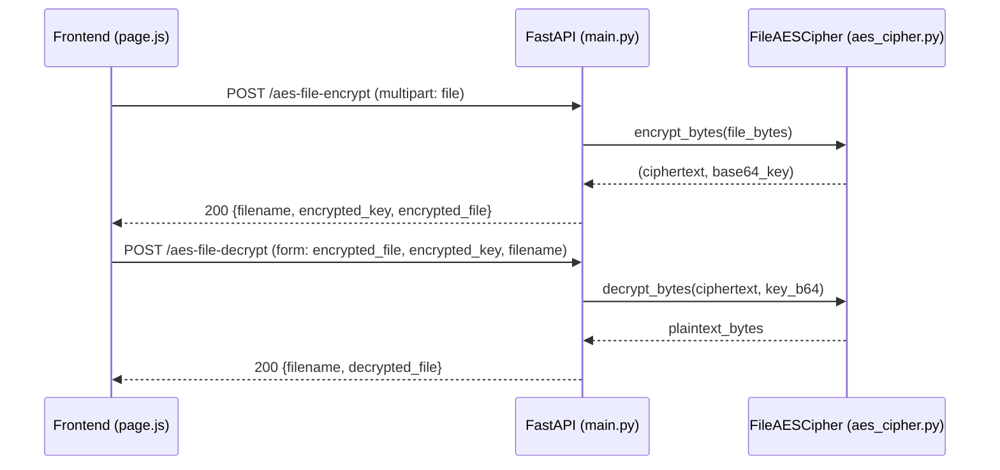

## Plan: Fix AES backend encryption

**TL;DR**
The backend currently has no AES support — there is no `aes_cipher.py` file, no AES text routes, and no AES file routes. The frontend at `frontend/src/app/page.js` calls `/aes-file-encrypt` and `/aes-file-decrypt` which 404 on Render. We'll add an AES-256-GCM implementation (either as a new module or inline), then wire two file routes that match the frontend's existing contract.

### Current state of `backend/`

- `main.py` — has RSA file routes, caesar/vigenere/playfair/hillfair text routes. **No AES routes at all.**
- `rsa_cipher.py` — `FileRSACipher` (generate_keys, encrypt_file, decrypt_file).
- **No `aes_cipher.py` exists.** No AES cipher implementation in the repo.

### Two approaches — pick one

**Approach A — Create `backend/aes_cipher.py` (mirrors RSA structure)**
- New file `backend/aes_cipher.py` with `FileAESCipher` class.
- Methods: `encrypt_bytes(file_bytes) -> (ciphertext, base64_key)` and `decrypt_bytes(ciphertext, base64_key) -> plaintext`.
- Use `cryptography.hazmat.primitives.ciphers.aead.AESGCM` with a random 32-byte key per file.
- Import in `main.py` and add the two routes.

**Approach B — Inline AES in `main.py`**
- No new file. Add a small helper function at the top of `main.py` that uses `AESGCM` directly.
- Add the two routes using that helper.
- Faster to ship but mixes cipher logic with HTTP layer.

**Recommendation: Approach A.** It mirrors the existing `FileRSACipher` pattern, keeps `main.py` focused on routing, and matches what the earlier (unfounded) assumption expected.

### Step-by-step (Approach A)

1. **Create `backend/aes_cipher.py`** with a `FileAESCipher` class:
   - `__init__` — no state needed; key is per-call.
   - `encrypt_bytes(file_bytes)` — generate `os.urandom(32)`, encrypt with `AESGCM(key).encrypt(nonce, file_bytes, None)`, return `(ciphertext_with_nonce, base64.b64encode(key).decode())`. The 12-byte nonce is prepended to the ciphertext so decryption needs only the key.
   - `decrypt_bytes(ciphertext_with_nonce, base64_key)` — decode key, split first 12 bytes as nonce, decrypt the rest.

2. **Update `backend/requirements.txt`** — confirm `cryptography` is listed (it is, since `rsa_cipher.py` uses it).

3. **Edit `backend/main.py`**:
   - Add `from aes_cipher import FileAESCipher` next to the existing `from rsa_cipher import FileRSACipher`.
   - Add `aes_cipher = FileAESCipher()` instance next to the existing `cipher = FileRSACipher()`.
   - Add the two routes below the existing RSA routes:

     ```python
     @app.post("/aes-file-encrypt")
     async def aes_file_encrypt(file: UploadFile = File(...)):
         file_data = await file.read()
         if len(file_data) > 100 * 1024 * 1024:
             raise HTTPException(status_code=413, detail="File exceeds the 100MB size limit.")
         try:
             ciphertext, key_b64 = aes_cipher.encrypt_bytes(file_data)
         except Exception as e:
             raise HTTPException(status_code=400, detail=f"Encryption failed: {str(e)}")
         return {
             "filename": file.filename,
             "encrypted_key": key_b64,
             "encrypted_file": base64.b64encode(ciphertext).decode("utf-8"),
         }


     @app.post("/aes-file-decrypt")
     async def aes_file_decrypt(
         encrypted_file: str = Form(...),
         encrypted_key: str = Form(...),
         filename: str = Form(...),
     ):
         try:
             ciphertext = base64.b64decode(encrypted_file)
             decrypted = aes_cipher.decrypt_bytes(ciphertext, encrypted_key)
         except Exception as e:
             raise HTTPException(status_code=400, detail=f"Decryption failed: {str(e)}")
         return {
             "filename": filename,
             "decrypted_file": base64.b64encode(decrypted).decode("utf-8"),
         }
     ```

4. **No frontend changes needed.** `frontend/src/app/page.js` already posts `FormData` with `file` and reads `data.encrypted_file` + `data.encrypted_key`, matching the new contract.

### Relevant files
- `backend/aes_cipher.py` (new) — `FileAESCipher` with AES-256-GCM.
- `backend/main.py` — add import, instance, and two routes.
- `backend/requirements.txt` — verify `cryptography` is listed.

### Diagrams

**Request/response flow**


**Crypto envelope layout**
```mermaid
flowchart LR
    A[plaintext bytes] --> B[AES-256-GCM encrypt<br/>key = os.urandom 32<br/>nonce = os.urandom 12]
    B --> C[nonce 12B || ciphertext+tag]
    C --> D[base64 envelope]
    E[key 32B] --> F[base64 key string]
    D --> G[response.encrypted_file]
    F --> H[response.encrypted_key]
```

### Verification
1. **Local**: start `uvicorn main:app --reload`, then:
   - `curl -F "file=@test.txt" http://localhost:8000/aes-file-encrypt` returns JSON with `encrypted_key` and `encrypted_file`.
   - `curl -X POST -F "encrypted_file=..." -F "encrypted_key=..." -F "filename=test.txt" http://localhost:8000/aes-file-decrypt` returns JSON with `decrypted_file` whose base64 decodes to the original bytes.
2. **Deploy to Render**, repeat the same `curl` tests against `https://encryption-system-web-1.onrender.com/`.
3. **Frontend smoke test**: open the deployed site, pick AES, upload a small file, click encrypt — should download a `.enc` file. Click decrypt with the key — should recover the original.

### Out of scope (for this plan)
- RSA file encrypt/decrypt frontend-contract alignment (you said to leave RSA alone for now).
- Text AES routes (`/aes-encrypt`, `/aes-decrypt`).
- Switching the frontend to use the same `/encrypt` and `/decrypt` dispatcher the text flow already uses.
